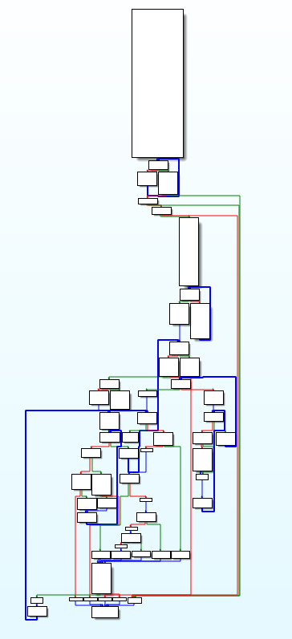
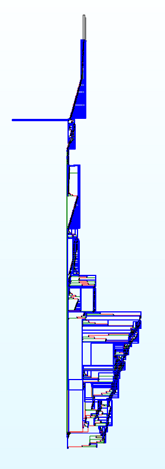

# Chained-CFG-obfuscation-pass
LLVM obfuscation pass, flattening at the basic block's level and turning each basic block into a dispacher and each instruction into a new basic block.
## Pass description
This CFG flattening pass is applied at the scope of the basic block which means that even programs with few basic block will be obfuscated. Even for a program constituted of a single basic block the result will be fine. This is why this pass can be pretty effective combined with some MBA operation : they can potentially increase the size of each basic block and therefore the number of case in the basic block's dispacher To the right way the dispacher is going to use a local variable for each function with a random value and calculate the next case's value.

* On the left we can see a non obfuscated binary
* On the right an obfuscated binary using the chained CFG flattening pass.




The raw size of the file is not much larger (in this case 20 % larger) but the graph is drastically different with much more basic bloc which symbolize a single program's instruction, the other part of the basic block is a xor operation on the local variable used by the dispacher to dinamically find his path in this giant mess.

## Build this pass
This pass uses the new pass manager which means you can build it with cmake (see this [tutorial](https://github.com/banach-space/llvm-tutor#helloworld-your-first-pass) and load either with clang or it via ```opt``` using this command:
```path/to/llvm/bin/opt -load-pass-plugin /build/folder/libPassTheFishe.so -passes=Pass-Fishe -O0 input.ll -o output.ll```.
Note that if you want to use the legacy pass manager you will need to change the pass implementation and registration in ```Pass/Pass.h``` file.
## What to do next?
* This CFG flattening is an intra-basic block obfuscation thus merging this pass with CFG flattening on other levels would be fun:
+ At the function level(inter-basic block)
+ At the module level (inter-function)
* As previously said, combining this pass with MBA operation can be really hard to reverse
